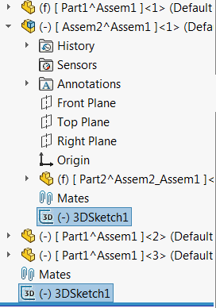

{ width=250 }

This VBA macro selects all features in the active model (part, assembly or drawing) using SOLIDWORKS API. For drawings and assemblies features in the children components are also selected.

Use this macro in conjunction with [Get Features Type Name](/solidworks-api/document/features-manager/get-feature-type-name/) to get the required feature type name for filtering.

## Configuration

Modify the constants in the beginning of the macro

~~~ vb
Const APPEND_SELECTION As Boolean = False 'True to append selection False to clear existing selection
Const TYPE_NAME As String = "" 'Refer 'Get Features Type Name' macro to get the type name from the feature
~~~

This macro can be useful with other macros which require features to be preselected. It can be also used with SOLIDWORKS batch operations (such as delete or suppress).

