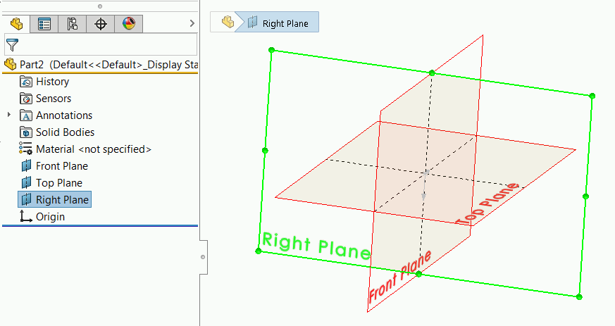

{ width=250 }

It is not recommended to select the standard planes by their names as names are not consistent and may be changed in the template (e.g. different localization or standard).

This example demonstrates how to select standard plane (Top, Front or Right) using SOLIDWORKS API by specifying its type so the selection will be consistent regardless of the plane name.

This macro works based on the fact that the default SOLIDWORKS planes are always ordered the same way, i.e. Front, Top and Right planes are the first planes in the model, positioned before the origin feature and cannot be reordered or removed.


