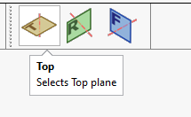

{ width=400 }

This example demonstrates how to select standard plane (Top, Front or Right) using SOLIDWORKS API by specifying its type so the selection will be consistent regardless of the plane name as it is not recommended to select the standard planes by their names as names are not consistent and may be changed in the template (e.g. different localization or standard).

This macro works based on the fact that the default SOLIDWORKS planes are always ordered the same way, i.e. Front, Top and Right planes are the first planes in the model, positioned before the origin feature and cannot be reordered or removed.

To configure the macro set the type of the plane to select in the **PLANE** constant

~~~ vb
Const PLANE As Integer = swPlanes_e.Right 'select right plane
~~~

This macro allows to specify if the plane should be scrolled into view by setting **SCROLL** constant

~~~ vb
Const SCROLL As Boolean = False' scroll plane into view
~~~

> Note, this macro will ignore the **Feature Manager -> Scroll selected item into view** option and scroll based on the option above preserving the setting in SOLIDWORKS.

Macro will append the selection if **ctrl** button is pressed.

It is recommended to use this macro with [Custom Toolbar](https://cadplus.xarial.com/custom-toolbar/) add-in so the buttons can be added to toolbar and assigned with shortcut for easier access.

You can download the icons from [here](icons.zip) or use your own icons.


