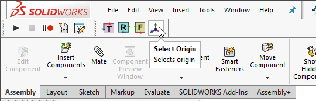

{ width=400 }

This example demonstrates how to select standard plane (Top, Front or Right) or origin using SOLIDWORKS API by specifying its type so the selection will be consistent regardless of the plane name as it is not recommended to select the standard planes by their names as names are not consistent and may be changed in the template (e.g. different localization or standard).

This macro selects the primary planes or origin of root document. To select primary planes or origin of the specific component in the assembly, hover the mouse over any component's entity (you do not need to select it) and run the macro.

This macro works based on the fact that the default SOLIDWORKS planes are always ordered the same way, i.e. Front, Top and Right planes are the first planes in the model, positioned before the origin feature and cannot be reordered or removed.



## Configuration

### Target plane or origin

To configure the macro set the type of the plane to select in the **REF_GEOM** variable. Supported values: **Right**, **Top**, **Front**, **Origin**

~~~ vb
Dim REF_GEOM As swRefGeom_e
~~~

~~~ vb jagged
#Else
    REF_GEOM = swRefGeom_e.Right 
#End If
~~~

### Scrolling to selection

This macro allows to specify if the plane should be scrolled into view by setting **SCROLL** constant

~~~ vb
Const SCROLL As Boolean = False' scroll plane into view
~~~

> Note, this macro will ignore the **Feature Manager -> Scroll selected item into view** option and scroll based on the option above preserving the setting in SOLIDWORKS.

### Appending selection

Macro will append the selection if **ctrl** button is pressed unless the **APPEND_SEL** constant is set to true. In this case selection will alway be appended. This is useful when shortcut are used for the macro buttons as **ctrl** will conflict with shortcut.

~~~ vb
Const APPEND_SEL As Boolean = True
~~~

## CAD+

This macro is compatible with [Toolbar+](https://cadplus.xarial.com/toolbar/) and [Batch+](https://cadplus.xarial.com/batch/) tools so the buttons can be added to toolbar and assigned with shortcut for easier access or run in the batch mode.

In order to enable [macro arguments](https://cadplus.xarial.com/toolbar/configuration/arguments/) set the **ARGS** constant to true

~~~ vb
#Const ARGS = True
~~~

In this case it is not required to make copies of the macro to set individual [target plane or origin](#target-plane-or-origin). Instead use the **FRONT**, **TOP**, **RIGHT**, **ORIGIN** arguments for the corresponding target entity.

You can download the icons for each button: [front plane](front.svg), [top plane](top.svg), [right plane](right.svg), [origin](origin.svg) or use your own icons.


