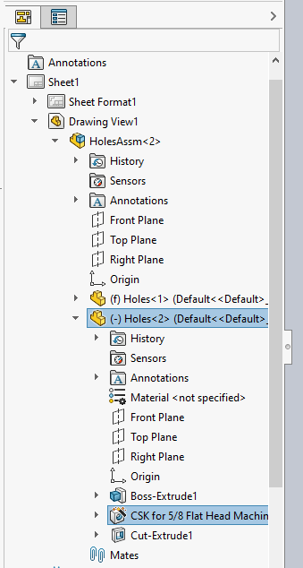

{ width=250 }

This VBA macro demonstrates how to find the pointers for the input feature from the model space in each view in the drawing and select it.

* Open the model drawing views are created from (i.e. assembly or part)
* Select any feature
* Run macro. Macro stops an execution
* Activate drawing
* Continue the macro. All corresponding features are selected in each view

## Using the GetCorresponding method

This approach utilizes the [IView::GetCorresponding](https://help.solidworks.com/2018/English/api/sldworksapi/SolidWorks.Interop.sldworks~SolidWorks.Interop.sldworks.IView~GetCorresponding.html) API methdo by converting the pointer from the assembly context into the drawing view context. This API is only available in SOLIDWORKS 2018 or newer for an alternative approach use the [Using SelectById2 method](#using-selectbyid2-method)



## Using SelectById2 method

This approach utilizes the [IModelDocExtension::SelectByID2](https://help.solidworks.com/2017/english/api/sldworksapi/solidworks.interop.sldworks~solidworks.interop.sldworks.imodeldocextension~selectbyid2.html) by composing the feature name to select.

