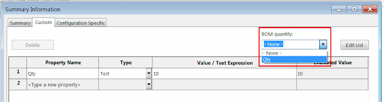
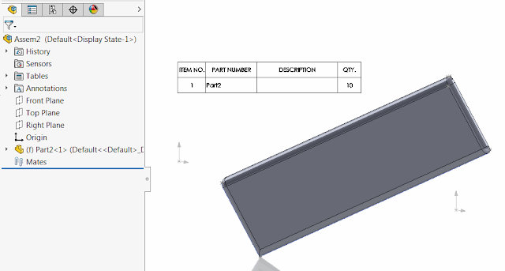

This example demonstrates how to modify the BOM quantity field in the properties dialog using SOLIDWORKS API.

{ width=640 height=170 }

This option allows overwriting the quantity value of the component in the BOM table

{ width=640 }

In order to change this property it is required to set the hidden *UNIT_OF_MEASURE* custom property via [ICustomPropertyManager](http://help.solidworks.com/2018/english/api/sldworksapi/solidworks.interop.sldworks~solidworks.interop.sldworks.icustompropertymanager.html) SOLIDWORKS API interface.


