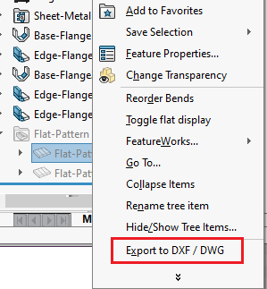

This VBA macro exports the sheet metal part or selected flat pattern feature in the multi-body sheet metal part to the DXF or DWG.

Change the value of *OUT_PATH* variable to save output to different location (change the extension to export to DXF or DWG).


