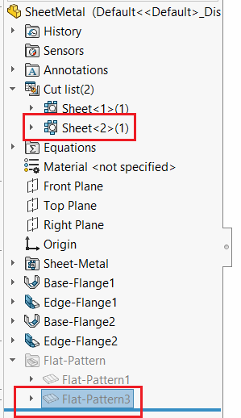

{ width=200 }

This VBA macro demonstrates how to find the corresponding cut-list folder feature from the selected sheet metal flat pattern feature.

This macro supports both flatten and unflatten state of sheet metal feature.


