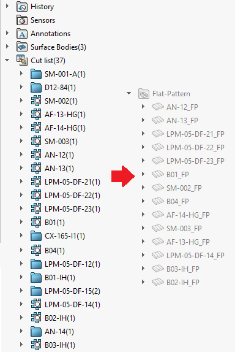

{ width=250 }

This VBA macro renames all sheet metal flat pattern features with the name of the corresponding cut-list item.

This macro can be used in conjunction with [Rename Cut List Features](/solidworks-api/document/cut-lists/rename-cut-list-items/) macro.

In order to avoid the name conflict, suffix is added to flat pattern features as below.

~~~ vb jagged-bottom
Const SUFFIX As String = "_FP"
~~~

Macro will automatically add the index to the flat pattern name which shares the same cut list.

Watch [video demonstration](https://youtu.be/jsjN8zNRTuc?t=276)


