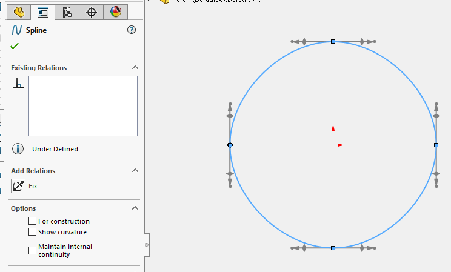

This VBA macro demonstrates how to create spline in the active sketch by loading points data from the CSV file. CSV file should contain 3 columns for the coordinates of spline nodes in meters. [Download sample spline data](spline-data.csv)

Specify full path to this file in the **CSV_FILE_PATH** constant


