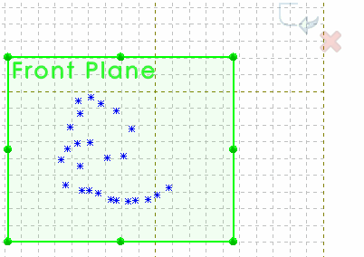

This macro imports the points read from the specified CSV (comma separated values) file into the active sketch using SOLIDWORKS API. Both 2D and 3D Sketches are supported.

## Configuration

Macro has several configuration options which can be modified by changing the values of the constants at the beginning of the macro

~~~ vb
Const USE_SYSTEM_UNITS As Boolean = True
Const FIRST_ROW_HEADER As Boolean = True
~~~

* **FIRST_ROW_HEADER** specifies if the if the first row of the CSV file is considered as a header and should be ignored ignored. If CSV file doesn't contain the header set the value of the constant to **False**.
* **USE_SYSTEM_UNITS** indicates if the coordinate values in the CSV file are in system units (meters). If this option is set to **False**, macro will use the current document units instead.
* Macro can also import points relative to coordinate system. Pre-select the target coordinate system before running the macro otherwise the points will be inserted relative to global coordinate system

> Input CSV file can contain 3 coordinates (X, Y, Z) or 2 coordinates (X, Y)

## Sample Files

* [Sample 2D Points Cloud CSV File](points-2d.csv)
* [Sample 3D Points Cloud CSV File](points-3d.csv)

## How To Run The Macro

* Open the model and create 2D or 3D sketch (or edit existing sketch)
* (Optional) Pre select coordinate system if points need to be imported relative to this system
* Run the macro. Specify the full path to CSV file in the displayed file browse dialog
* Click OK. Points are created in the active sketch


