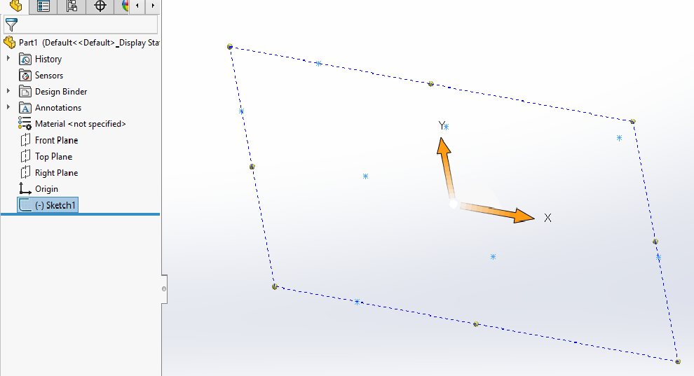
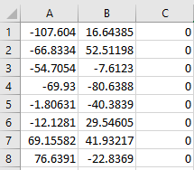

{ width=500 }

This VBA macro allows to export the coordinates of all sketch points from the selected sketch into the CSV file.

CSV file can be opened in Excel

Macro has an option to export coordinates in the sketch space (XY for 2D sketch) or in the model space (XYZ). Macro has an option to convert the points coordinates to system units (meters) or user units, currently assigned to the model.

Configure the macro by changing the constants below.

~~~ vb jagged-bottom
Const CONVERT_TO_USER_UNIT As Boolean = True 'True to use the current model units, False to use system units (meters)
Const CONVERT_TO_MODEL_SPACE As Boolean = True 'For 2D Sketches, True to export coordinates in the sketch space, False to convert coordinates to the model space
Const OUT_PATH As String = "D:\points.csv" 'Full path to the output file
~~~

