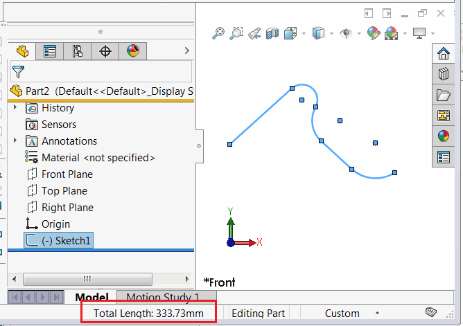

{ width=450 }

This C# example of [stand-alone console application](/solidworks-api/getting-started/stand-alone/) to calculate the total length of all segments in the selected sketch using SOLIDWORKS API. Construction geometry sketch segments are excluded from the calculation.


