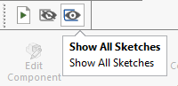

This macro will hide (blank) or show (unblank) all sketches (2D and 3D) in the active document using SOLIDWORKS API.

If the active document is an assembly, sketches from all components will be included as well.

{ width=320 }

## Configuration

Change *HIDE_ALL_SKETCHES* option to specify if sketches need to be hidden or shown.

## CAD+

This macro is compatible with [Toolbar+](https://cadplus.xarial.com/toolbar/) and [Batch+](https://cadplus.xarial.com/batch/) tools so the buttons can be added to toolbar and assigned with shortcut for easier access or run in the batch mode.

In order to enable [macro arguments](https://cadplus.xarial.com/toolbar/configuration/arguments/) set the **ARGS** constant to true

~~~ vb
#Const ARGS = True
~~~

In this case it is not required to make copies of the macro to set individual [options to hide and show](#configuration). Instead use the **-hide**, **-show** arguments to hide and show sketches correspondingly.

You can download the icons for each button: [hide sketches](hide-sketches.svg), [show sketches](show-sketches.svg) or use your own icons.

Watch [video demonstration](https://youtu.be/jsjN8zNRTuc?t=23)


