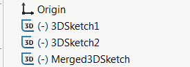

This VBA macro merges the selected sketches (3D and 3D) into a single 3D sketch using SOLIDWORKS API. This macro is using convert entities API to copy the entities from the source sketches to a target sketch.

## Options

Macro can be configured by changing the values of the constant at the beginning of the macro

* *DELETE_SOURCE_SKETCHES* - True to delete original source sketches, False to not delete
* *NEW_SKETCH_NAME* - Name for the newly generated merged sketch, Empty string to use default auto generated name

~~~ vb
Const DELETE_SOURCE_SKETCHES As Boolean = True 'delete all source sketches
Const NEW_SKETCH_NAME As String = "MergedSketch" 'new merged sketch to be named 'MergedSketch'
~~~

## Notes

* Sketches in the assembly or drawings components are also supported
* Relations and dimensions from the source sketch are not copied to a target sketch
* Sketches are merged to an active 3D sketch, or new 3D sketch is created automatically

Use this macro in conjunction with [Select Features By Type](/solidworks-api/document/selection/select-features-by-type/) to select all sketches to be merged.

