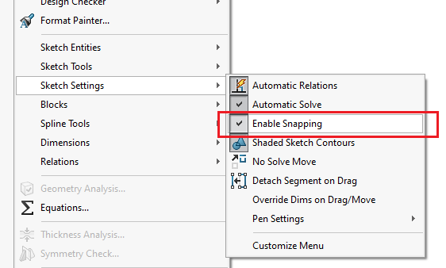
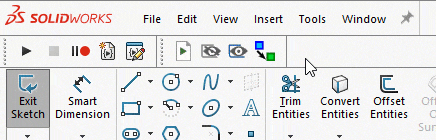
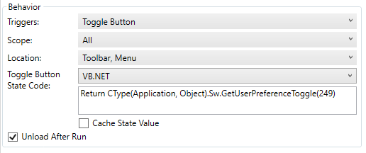

This VBA macro allows to toggle on and off the 'Enable' option in SOLIDWORKS sketch.

## Using macro in Toolbar+

This macro can be used in [Toolbar+](https://cadplus.xarial.com/toolbar/) which will improve the user experience. It is possible to enable the [toggle state](https://cadplus.xarial.com/toolbar/configuration/toggles/) for the macro button.

Paste this code into the "Toggle Button State Code" text box:

~~~ vb
Return CType(Application, Object).Sw.GetUserPreferenceToggle(249)
~~~

Download icon [here](toggle-snapping.svg)

