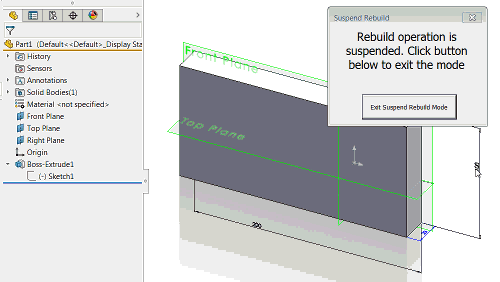

This macro us using SOLIDWORKS API to suspend rebuild operation for parts, assemblies and drawings to enhance the performance.

When macro started form is displayed. While form is open all rebuild operations (regenerations) will be suspended.
For example dimension changes or mates will not resolve until **Exit Suspend Rebuild Mode** button is clicked.

[Download Macro](FreezeRebuild.swp)

**Main Module**



**User Form**


