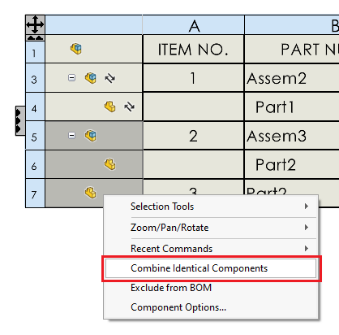

This VBA macro demonstrates how to emulate the *Combine identical component* command which is missing in SOLIDWORKS API.

Select BOM table to combine identical components. By default, all components are combined, however it is possible to specify the rows to combine by changing the parameters of **CombineIdenticalComponents** function in the macro.

