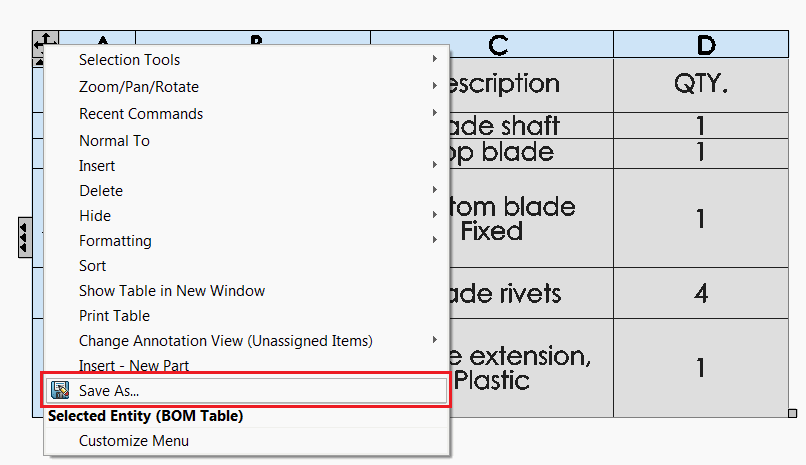
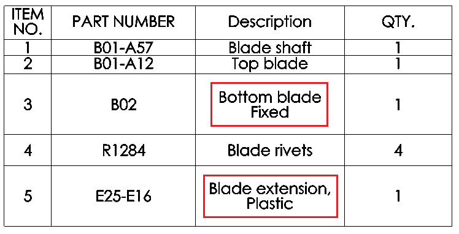
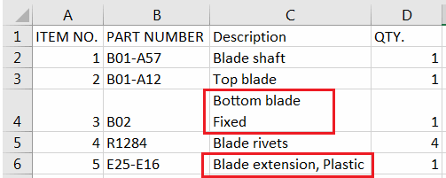

This macro exports the selected tables (or tables by specified type) to the CSV (Comma Separated Values) file using SOLIDWORKS API. This functionality is similar to built-in 'Save As' option for table:

{ width=350 }

However macro preserves the special symbols like commas, quotes or new line symbols and properly escapes them according to the CSV specification:

{ width=350 }

So the file can be later properly read using the CSV readers like MS Excel;

{ width=350 }

For the above example BOM table the macro will generate the following output:

~~~ csv
ITEM NO.,PART NUMBER,Description,QTY.
1,B01-A57,Blade shaft,1
2,B01-A12,Top blade,1
3,B02,"Bottom blade
Fixed",1
4,R1284,Blade rivets,4
5,E25-E16,"Blade extension, Plastic",1
~~~

## Configuration

Macro can be configured by modifying the value of the constants

~~~ vb
Const OUT_FILE_PATH_TEMPLATE As String = "<_FileName_>-<_TableName_>.csv" 'empty string to save in the model's folder
Const INCLUDE_HEADER As Boolean = True 'True to include the table header, False to only include data
Const TABLE_TYPE As Integer = swTableAnnotationType_e.swTableAnnotation_BillOfMaterials  '-1 to use selected table or table type as defined in swTableAnnotationType_e (e.g. swTableAnnotationType_e.swTableAnnotation_BillOfMaterials to export all BOM tables)

Const MERGE As Boolean = False 'True to merge all tables into a single file
~~~

*OUT_FILE_PATH_TEMPLATE* can be either relative path or an absolute path. If relative path is specified the file will be saved in the same directory as the source file

The following placeholders are supported:

* <\_FileName\_> - name of the source file
* <\_TableName\_> - name of the table
* <\_SheetName\_> - name of the sheet of the table (only applicable in the drawings)

If **MERGE** option is used all table data will be output into a single CSV file and each table will be separated by an empty row. If file name template is using table specific placeholder, first table will be used as the template.

## CAD+

This macro is compatible with [Toolbar+](https://cadplus.xarial.com/toolbar/) and [Batch+](https://cadplus.xarial.com/batch/) tools so the buttons can be added to toolbar and assigned with shortcut for easier access or run in the batch mode.

In order to enable [macro arguments](https://cadplus.xarial.com/toolbar/configuration/arguments/) set the **ARGS** constant to true

~~~ vb
#Const ARGS = True
~~~

In this case it is not required to make copies of the macro to set individual [options to hide and show](#configuration).

Instead use the **-bom**, **-general**, **-revision**, **-cutlist** as the first argument to specify the type of the table to export and optional output file template as the second parameter

For example, the below parameter will export BOM table into the CSV format into the **Tables** folder in D drive with the name of source table.

~~~
> -bom "D:\Tables\<_TableName_>.csv"
~~~


