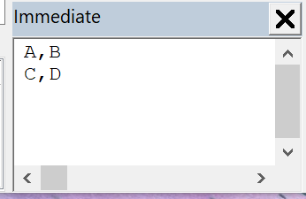

This VBA macro finds the table by the specified value pattern in the specified cell.

{ width=500 }

The data of the table is read into the string variable **tableData** and output into the [VBA Immediate Window](/visual-basic/vba/vba-editor/windows#immediate-window)

Cells are separated by the value of the **DELIMETER** constant.

It is possible to use the matching pattern to match the value of the cell (e.g. **\*ABC\*** will match text containing **ABC**)

Text comparison is case insensitive

Indices of the row and column to search are 0-based (e.g. first cell in the first column will have an index **0, 0**)

Provide the value of the search pattern and the target cell position in the call to **FindTableByContent** function

~~~ vb jagged
Set swTableAnnotation = FindTableByContent(swDraw, "*ABC*", 0, 0)
~~~

