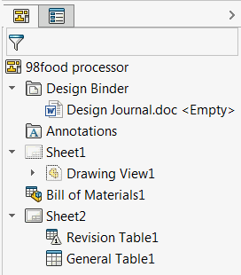

{ width=250 }

This examples allows to find all tables by specified type from the active drawing document using SOLIDWORKS API.

It is required to specify the array of types using the Array function, where each value represents the type of the table (BOM, general, cut-list, revision, title block etc.) as defined in [swTableAnnotationType_e](https://help.solidworks.com/2017/english/api/swconst/solidworks.interop.swconst~solidworks.interop.swconst.swtableannotationtype_e.html) enumeration.

As the result array of pointer to [ITableAnnotation](https://help.solidworks.com/2017/english/api/sldworksapi/SolidWorks.Interop.sldworks~SolidWorks.Interop.sldworks.ITableAnnotation.html) SOLIDWORKS API interface is returned and title of each table is output to the immediate window of VBA editor.

