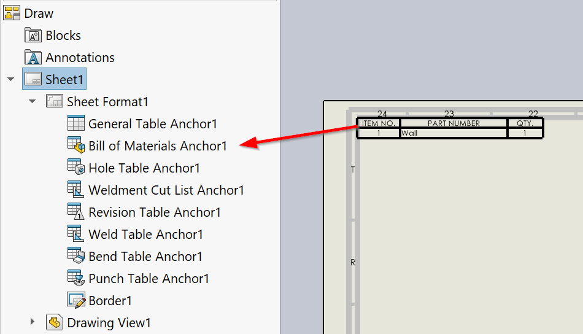

{ width=600 }

This VBA macro inserts Bill Of Materials (BOM) table into all or active sheet of the active SOLIDWORKS drawing. First drawing view of the sheet is used as the source

BOM table is attached to the BOM anchor point

Modify the constants in the macro to configure the BOM table options

~~~ vb
Const ANCHOR_TYPE As Integer = swBOMConfigurationAnchorType_e.swBOMConfigurationAnchor_TopLeft 'anchor type: swBOMConfigurationAnchor_BottomLeft, swBOMConfigurationAnchor_BottomRight, swBOMConfigurationAnchor_TopLeft, swBOMConfigurationAnchor_TopRight
Const BOM_TYPE As Integer = swBomType_e.swBomType_PartsOnly 'bom type: swBomType_Indented, swBomType_PartsOnly, swBomType_TopLevelOnly
Const TABLE_TEMPLATE As String = "" 'full path to BOM template *.sldbomtbt or empty string for the default template
Const INDENTED_NUMBERING_TYPE As Integer = swNumberingType_e.swNumberingType_Flat 'numbering type (if BOM_TYPE is swBomType_Indented): swIndentedBOMNotSet, swNumberingType_Detailed, swNumberingType_Flat, swNumberingType_None
Const DETAILED_CUT_LIST As Boolean = False 'detailed cut-list (if BOM_TYPE is swBomType_Indented)
Const FOLLOW_ASSEMBLY_ORDER As Boolean = True 'true to check the Follow Assembly Order option

Const ALL_SHEETS As Boolean = True 'True to process all sheets, False to process active sheet only
~~~

