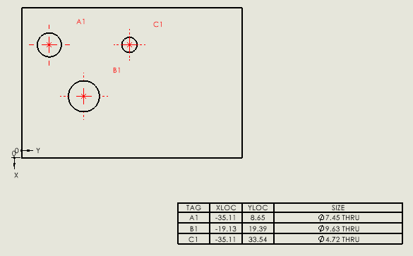

{ width=300 }

This macro demonstrates how to insert holes table into the existing drawing.

Before running the macro it is required to preselect input objects in the following order.

1. Vertex which corresponds to an origin
1. Edge which corresponds to X axis
1. Edge which corresponds to Y axis
1. Face which contains holes

Macro will clear the selection and reselect entities.

Table is inserted using default template into 0,0 coordinate.

 > Note, in your case you might be using different approach of retrieving the pointers to entities. 

 