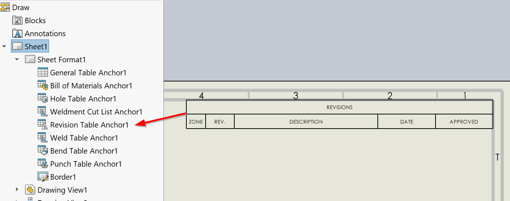

{ width=600 }

This VBA macro inserts Revision table into all or active sheet of the active SOLIDWORKS drawing.

Revision table is attached to the Revision anchor point

Modify the constants in the macro to configure the Revision table options

~~~ vb
Const ANCHOR_TYPE As Integer = swBOMConfigurationAnchorType_e.swBOMConfigurationAnchor_TopLeft 'anchor type: swBOMConfigurationAnchor_BottomLeft, swBOMConfigurationAnchor_BottomRight, swBOMConfigurationAnchor_TopLeft, swBOMConfigurationAnchor_TopRight
Const TABLE_TEMPLATE As String = "" 'full path to Revision template *.sldrevtbt or empty string for the default template
Const SHAPE As Integer = swRevisionTableSymbolShape_e.swRevisionTable_CircleSymbol 'symbol shape: swRevisionTable_CircleSymbol, swRevisionTable_HexagonSymbol, swRevisionTable_SquareSymbol, swRevisionTable_TriangleSymbol
Const AUTO_UPDATE_ZONE_CELLS As Boolean = True 'True to auto update zone cells

Const ALL_SHEETS As Boolean = True 'True to process all sheets, False to process active sheet only
~~~

