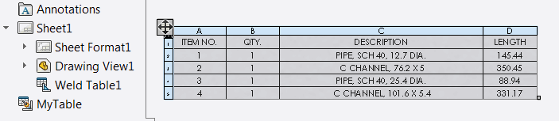

{ width=450 }

This example demonstrates how to rename the selected table using SOLIDWORKS API via [ITableAnnotation](http://help.solidworks.com/2012/english/api/sldworksapi/SolidWorks.Interop.sldworks~SolidWorks.Interop.sldworks.ITableAnnotation.html) interface. Table should be selected in the graphics area (not in the feature tree)

Specify the name of the table by modifying the constant at the beginning of the macro:

~~~ vb
Const TABLE_NAME As String = "MyTable"
~~~


