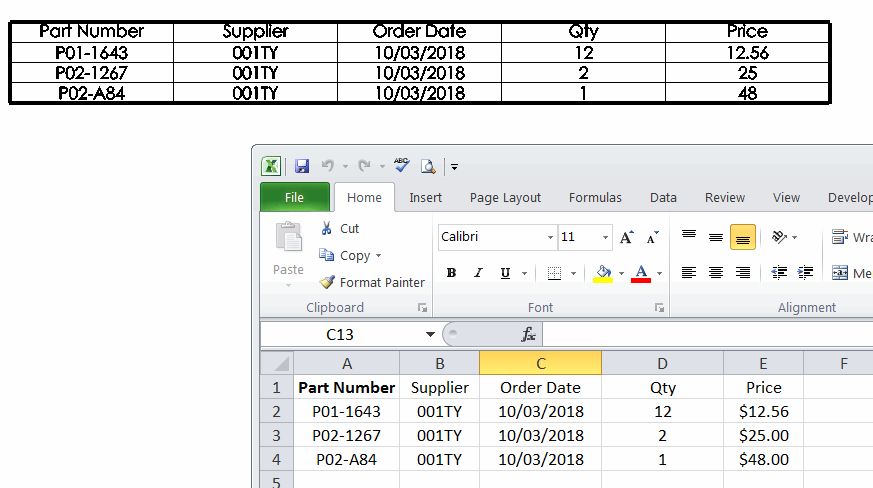

This macro will write the data into the newly created general table of the active document from the specified Excel spreadsheet using SOLIDWORKS API.

Specify the full path to excel file and the name of the spreadsheet in the constants defined in the header of the macro.

In order order to update existing general table instead of creating new one, select the general table in the graphics view or from the feature manager tree and run the macro.

This macro can be embedded into the [Macro Feature](solidworks-api/document/macro-feature) which will allow automatic update of the table. Follow the [Link And Auto Update General Table To Excel](solidworks-api/document/macro-feature/general-table-link-excel/) for more information about this option.

{ width=500 }

