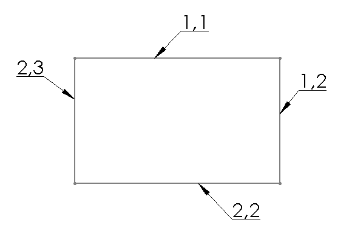

{ width=350 }

Internal ids are usually Integer or Long values which uniquely identify the SOLIDWORKS object within the model. Ids are persistent and do not change across rebuild operations or sessions. Ids also updated when the object is changed (e.g. feature is renamed or sketch line changes the coordinates).

> Sketch elements (points, segments, hatches) consist of 2 Integer or Long ids

Same as [Persistent Reference IDs](solidworks-api/document/tracking-objects/persist-references) internal ids cannot be changed or assigned and not visible from the GUI (e.g. only available within the APIs). But unlike persistent reference ids, object cannot be looked up by internal id, i.e. it is required to traverse all objects in order to find required one by id.

Internal ids should be used if it is required to index all elements (e.g. sketch segments or features) and minimize the size of the indexed data (for example if it is required to store the data within the 3rd party storage or send via network).

Internal ids can be accessed for the following objects

* Component
* Configuration
* Feature
* Layer
* Light
* Sheet
* Sketch Hatch
* Sketch Point
* Sketch Segment

Following example demonstrates how to retrieve the internal id from the selected object using SOLIDWORKS API. The returned array of ids also contains the type of the object as defined in ElementType_e enumerator.


