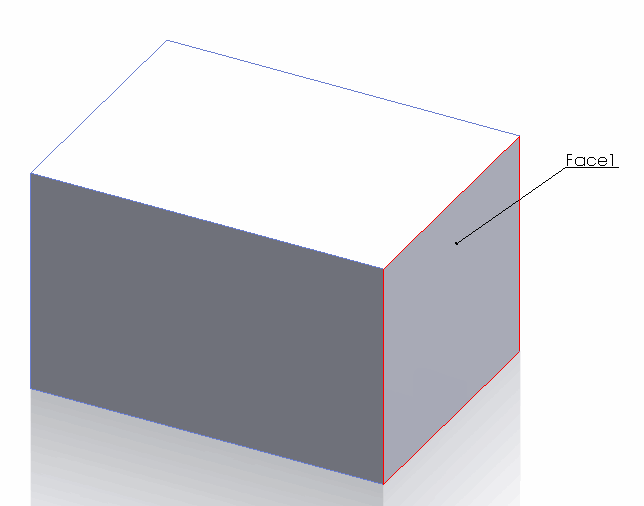
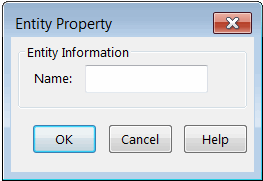
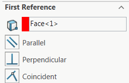

{ width=300 }

Some SOLIDWORKS objects in models can have user names assigned to them. The names are unique identification of the object in the model and it is persistent across rebuild operations or sessions. Names available for viewing and editing from the GUI.

The following object types have names assigned to them

* Component
* Configuration
* Feature
* Layer
* Body
* Sheet
* Dimensions
* Entity (Face, Edge, Vertex)
* Sketch Segment (Line, Arc, Spline, Ellipse)
* Drawing View

### Entity Names

By default names of entities (faces, edges, vertices) are not assigned.

Entity name can be changed from the **Entity Property** dialog. Refer [Displaying Entity Properties](https://help.solidworks.com/2017/english/solidworks/sldworks/hidd_ent_property.htm)

### Notes and Limitations

* Sketch segment names cannot be changed neither from GUI nor from API

* Names displayed in the selection boxes are not the real names of entities. These are just temporarily assigned names for differentiation the selection in the currently opened property manager page. Those names should not be used as the reference.

* While changing the name of the component it is required to consider several factors. Refer [Renaming Components](solidworks-api/document/assembly/components/rename/) for more information

The following example allows to rename the selected object with the specified name using SOLIDWORKS API.


