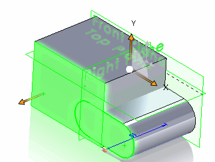

Tracking ids are used to map (track) entities across geometrical operations such as merge, subtract, copy, split, pattern while developing macros and applications using SOLIDWORKS API.

Tracking ids can be applied to faces, edges, loops, vertices and bodies.

Tracking ids are assigned temporarily until the model rebuilt.

Mainly the tracking ids are used for operations with temp bodies when it is required to track specific elements when the body get changed. Usually this is required in macro features.

Following example demonstrates the use of tracking ids from SOLIDWORKS API to track and map the user selected faces to the copied merged body.

* Download [Example File](tracking-ids-sample.SLDPRT) or use any other part document
* Select at least one face. It is recommended to select at least two faces from the different bodies which are overlapping each other. This would allow to demonstrate the benefit of tracking ids as body will be merged.
* Run the macro.

{ width=300 }

Macro will perform the following steps

* Collect all selected faces
* Find all bodies from the selected faces
* Clear all existing tracking ids if any
* Make a copy of the bodies
* Merge all bodies into one
* Create new part document
* Create new body from the merged copy
* Find the faces which correspond to originally selected faces
* Select those corresponding faces in the merged body

{ width=250 }

