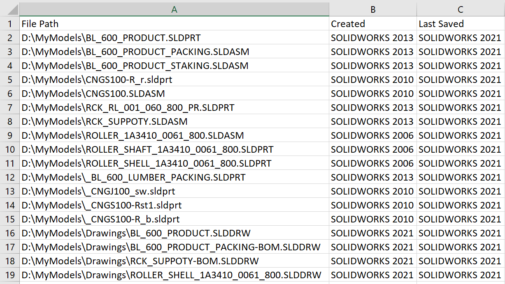

 { width=500 }

This VBA macro generates a CSV report (can be opened in Excel) of created and last saved version of SOLIDWORKS file in the specified folder.

> This macro will not be opening each model individually which significantly reduces the processing time

Macro input and output parameter can be configured by changing the constants below

~~~ vb
Const INPUT_FOLDER_PATH As String = "D:\MyModels" 'full path to the input folder with SOLIDWORKS files
Const OUT_FILE_PATH As String = "D:\sw-file-versions.csv" 'full path to the output CSV file of the report
Const FILES_FILTER As String = "*.sld*" 'Filter for files with the support of wildcards
Const INCLUDE_SUB_FOLDERS As Boolean = True 'True to process sub-folders, False to only process top level files
~~~

