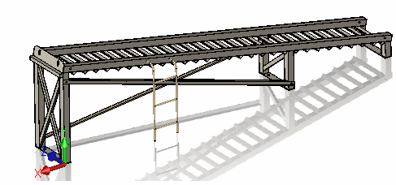
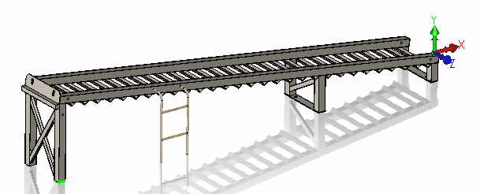
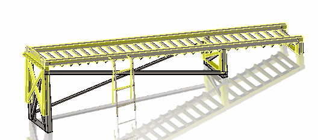

This macro allows to compare two parts by its geometry.

[IBody2::GetCoincidenceTransform2](http://help.solidworks.com/2018/english/api/sldworksapi/solidworks.interop.sldworks~solidworks.interop.sldworks.ibody2~getcoincidencetransform2.html) SOLIDWORKS API is used to compare bodies and if equal find the transformation between them.

### Notes

* Macro supports multi-bodies parts
* Macro will compare the bodies even if they are located in different position (i.e. moved or rotated) in the comparable parts.
* Comparable parts might have different number of bodies
* Macro will try to find the most suitable transformation between two parts

### Example

Original part to be compared:

{ width=250 }

Part to compare

{ width=250 }

Second part has a modified geometry and was reoriented in space. Some of the bodies have been deleted from the second part.

The following result is calculated by the macro:

{ width=250 }

### Instructions

* Open the original part file
* Run the macro.
* Specify the full path for the part file to compare to
* As the result second part is displayed within the original part
* Continue the macro (F5) to clear the preview

