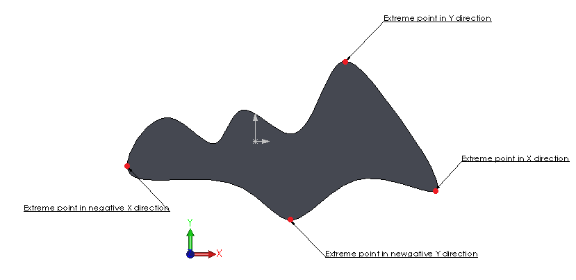
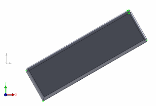

Extreme points are usually used to find the most remote points in the specified directions. The points can be found using the [IBody2::GetExtremePoint]( http://help.solidworks.com/2012/english/api/sldworksapi/solidworks.interop.sldworks~solidworks.interop.sldworks.ibody2~getextremepoint.html) SOLIDWORKS API.

This function expects direction vector as an input and returns the X, Y, Z coordinate of the extreme point in this direction as out parameters.

It is not required to specify the point on the vector when defining the direction.
This function is usually used to find the bounding dimension of the body, especially when the body orientation is not aligned with global XYZ coordinate as it is not required to reorient the body to find its best fit bounding box.

Unlike bounding box returned via [IBody2::GetBodyBox]( http://help.solidworks.com/2012/english/api/sldworksapi/solidworks.interop.sldworks~solidworks.interop.sldworks.ibody2~getbodybox.html) or any other bounding box function extreme points are precise which means that this data can be used for comparison and calculation purposes.

Image below demonstrates typical extreme points in multiple directions of the model.

{ width=400 }

The following code example will find the extreme points of the selected body in XYZ directions and create a sketch points.

{ width=320 height=217 }


