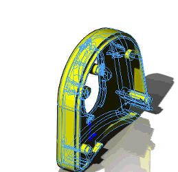
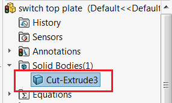

This VBA example demonstrates how to create a rotation animation of a selected body in part document using SOLIDWORKS API.

There will be no additional features created in the Feature Manager tree. This macro **is not** using the SOLIDWORKS motion study. Body is rotated around Y axis at origin. Animation is created using the temp bodies and original body or feature manager tree is not affected.

Select body from the Feature Manager tree and run the macro.

{ width=250 }

Preview of the body is created and rotated until selection is cleared. When macro stops the original body is reverted to the original state.


