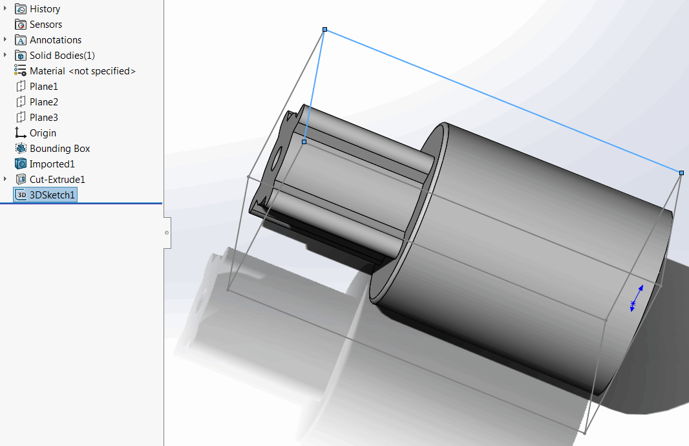

{ width=450 }

SOLIDWORKS enables the functionality to insert 3D bounding box into the part document. However the edges (segments) of this bonding box cannot be selected and used for the modelling purposes.

This VBA macro creates a bounding box sketch based on SOLIDWORKS 3D bounding box. All segments from the sketch can be selected and used for reference or geometry creation.

## Notes

* Macro will use existing 3D bonding box or create new one if not exists
* Generated bounding box is automatically updated when original bounding box changes (after the rebuild)
    * It is required for the original bounding box to be visible to update the derived bounding box


