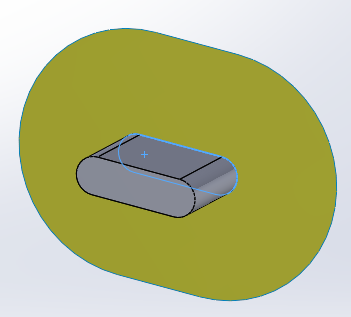

This VBA macro demonstrates how to create a temp body preview of the extended surface based on the face selected in the graphics area

Macro will stop execution and display the preview. Preview is hidden when macro completes

{ width=400 }



