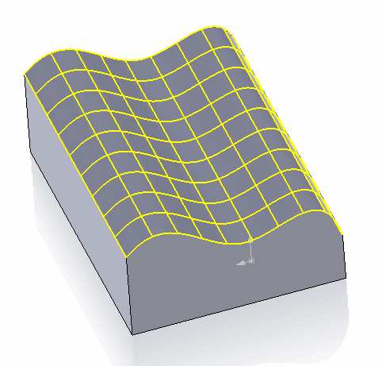
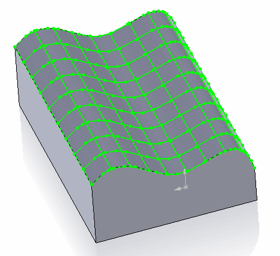

{ width=300 }

This example demonstrates how to find specified number of iso-curves in the u and v bounds of the selected face using SOLIDWORKS API.

* Select the face and run the macro
* Iso curves are previewed and macro execution stops
* Continue the macro to clear the preview

Number of iso curves in u and v direction can be changed in the following snippet

~~~ vb
Dim vCurves As Variant
vCurves = GetIsoCurves(swFace, <Number of curves in u direction>, <Number of curves in v direction>)
~~~

Optionally macro allows to create curves in the 3D Sketch.

{ width=300 }

This option can be enabled by setting *CREATE_SKETCH* constant to *True* at the beginning of the macro:

~~~ vb
Const CREATE_SKETCH As Boolean = True
~~~

**Macro:**


