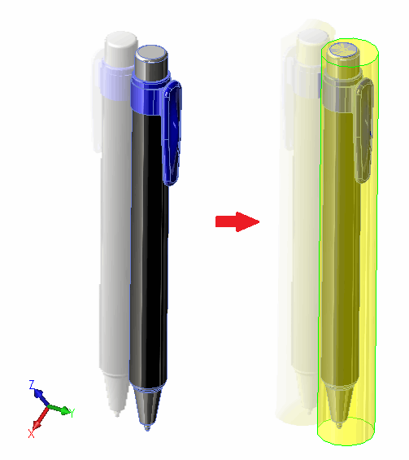
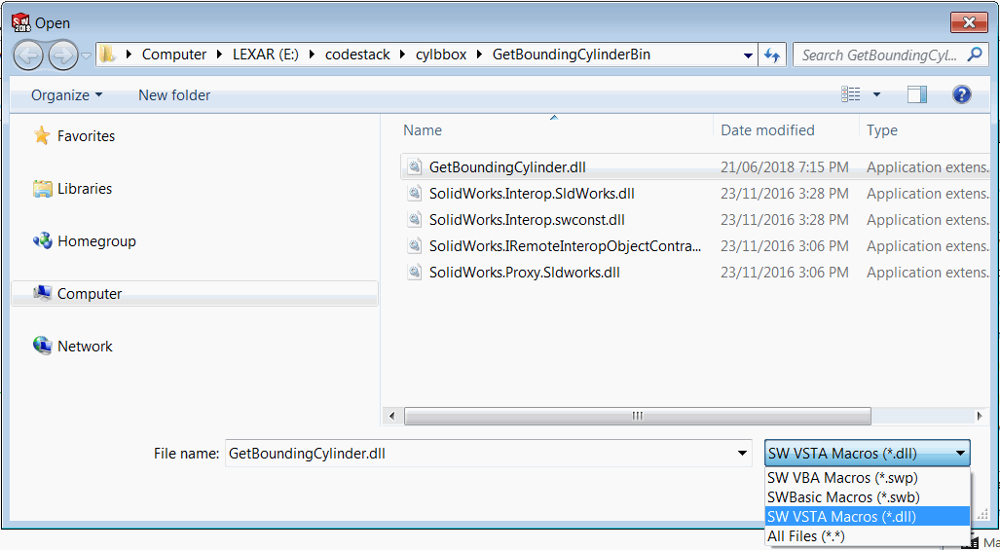

{ width=400 }

This example demonstrates how to find the bounding cylinder of the solid body using SOLIDWORKS API.

Macro requires user to select the input parameter to identify the direction of the cylinder. User either needs to select circular face (in this case the axis will be used as the reference) or plane feature (in this case the normal will be used as the reference).

As the result new feature is created representing the cylindrical boundary of the body.

> This macro will create best-fit bounding cylinder for the bodies at any orientation. It is no necessarily to have the body aligned with XYZ axes.

Macro can be downloaded at [this link](GetBoundingCylinderBin.zip). Unzip the macro and run it from Tools->Macro->Run menu command. Specify the correct filter as shown below:

{ width=500 }

### SolidWorksMacro.cs
This is an entry point of VSTA macro. In this module the input parameters are processed and the output body is created


### CylinderParams.cs
This structure represents the details of the bounding cylinder


### BodyHelper.cs
This utility class allows to find the orientation of the body and fit it into the cylinder


### BodyHelper.cs
This module provides utility functions for working with vectors, transformations and points


This macro requires a reference to the [Smallest enclosing circle - Library (C#)](https://www.nayuki.io/page/smallest-enclosing-circle) by Project Nayuki.