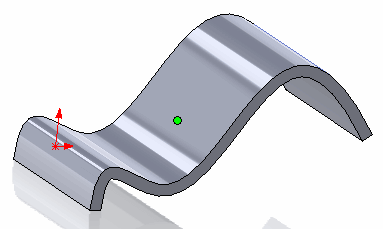

{ width=250 }

This example demonstrate how to find the parameters (point coordinate and normal) at the center of the face using SOLIDWORKS API. This macro will work with any type of face (planar, cylindrical, toroidal, b-surface etc.)

Center is found as the average of minimum and maximum values of U and V parameters using the [ISurface::Evaluate](https://help.solidworks.com/2018/english/api/sldworksapi/solidworks.interop.sldworks~solidworks.interop.sldworks.isurface~evaluate.html) SOLIDWORKS API method.

