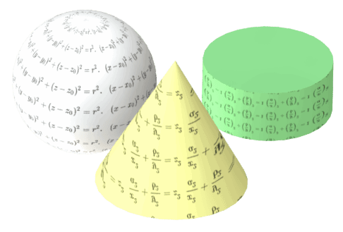

{ width=250 }

SOLIDWORKS API provides a low level access to geometry generation and processing via [IModeler](http://help.solidworks.com/2018/english/api/sldworksapi/SolidWorks.Interop.sldworks~SolidWorks.Interop.sldworks.IModeler.html) interface.

This interface allows to manipulate the geometry on a kernel level:

* Create surfaces from boundary representation (BREP) data
* Create curves
* Trim curves and surfaces

Geometry API is most commonly used to generate and modify bodies in [Macro Features](solidworks-api/document/macro-feature/).

This section contains examples of working with geometry (adding, editing) using SOLIDWORKS API.

## Previewing Temp Geometry

Temporary geometry is invisible and resides in memory. However it can be very useful to preview the geometry to troubleshoot. Below are code snippets allowing to preview different types of temp geometry

### Previewing Curves

Curves can be previewed by converting them into the temp wire bodies which can be displayed in the graphics area.

~~~ vb
PreviewCurves swModel, swCurve1, swCurve2, swCurve3
...
Sub PreviewCurves(model As SldWorks.ModelDoc2, ParamArray curves() As Variant)
    
    Dim i As Integer
    Dim swPreviewBody() As SldWorks.Body2
    
    If Not IsEmpty(curves) Then
        
        ReDim swPreviewBody(UBound(curves))
        
        For i = 0 To UBound(curves)
            Dim swCurve As SldWorks.Curve
            Set swCurve = curves(i)
            Set swPreviewBody(i) = swCurve.CreateWireBody()
            swPreviewBody(i).Display3 model, RGB(255, 255, 0), swTempBodySelectOptions_e.swTempBodySelectOptionNone
        Next
        
    End If
    
    Stop
    
    If Not IsEmpty(curves) Then
        For i = 0 To UBound(curves)
            Set swPreviewBody(i) = Nothing
        Next
    End If
    
End Sub
~~~