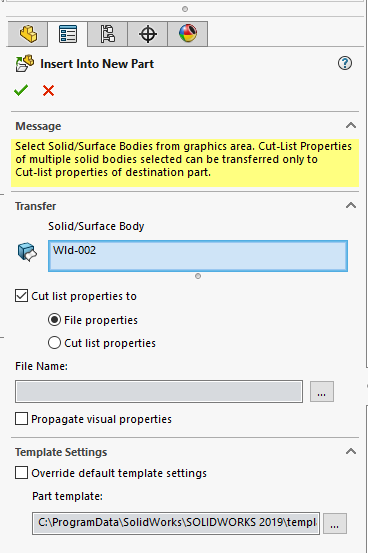

{ width=250 }

This macro saves all bodies from the active part document into individual part documents.

## Configuration

Specify the option to handle the transfer of custom properties by modifying the **CUT_LIST_PRPS_TRANSFER** constant

Specify the output directory in the **OUT_DIR**. If this variable is empty then bodies will be saved in the same directory as source part document.

~~~ vb
Const CUT_LIST_PRPS_TRANSFER As Long = swCutListTransferOptions_e.swCutListTransferOptions_CutListProperties 'move properties to cut-lists
Const OUT_DIR As String = "D:\Parts" 'Export bodies to the Parts directory
~~~

## Notes

* Bodies remain linked to the original part
* Output files will be named after the bodies
* Special symbols which cannot be used in the file name (e.g. ?, \*, : etc) will be replaced with _
* Macro will not create an output folder if it does not exist and will fail

