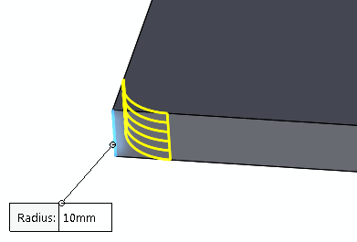
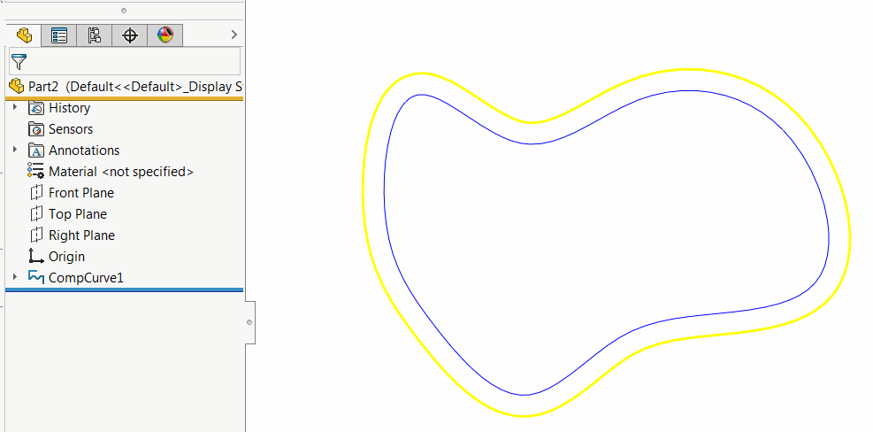

This VBA example demonstrates how to offset the wire body of the SOLIDWORKS curve and display the preview using SOLIDWORKS API.

Wire bodies are type of bodies which correspond to edges and curves.

Wire bodies are used in the features such as composite curve, curve through XYZ, etc. Those bodies are also used to generate some types of previews, e.g. preview of the fillet feature

{ width=350 }

To run this example

* Create a composite curve (or other type of the curve) on the Front plane, i.e. the normal is {0, 0, 1}
* Run the macro. Macro extracts the body from the selected curve. This body would be a wire body. Macro offsets this body by 10 mm and displays the preview of the offset.
* Macro stops execution. Once continued the temp body is destroyed

{ width=450 }


