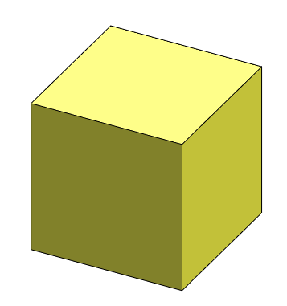

{ width=250 }

This VBA example demonstrates how to create and display temp body by providing the coordinate of center of base face, direction, width, length and height using SOLIDWORKS API.

Macro stops the execution and displays the body. Continue macro execution to destroy the temp body.


