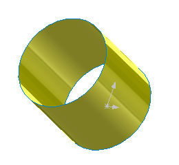

This example demonstrates how to create a sheet body from the cylindrical surface using SOLIDWORKS API.

Run the macro and temp body is displayed. Body can be rotated and selected but it is not presented in the feature tree. Continue the macro execution to destroy the body.


