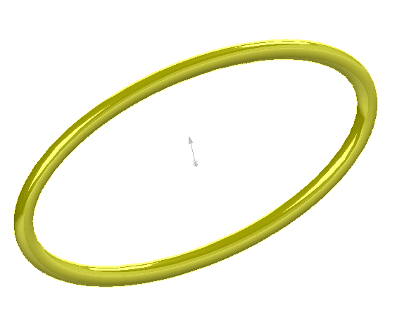

{ width=250 }

This example demonstrates how to sweep the circular profile along elliptical path to create a temp body using SOLIDWORKS API.

The [IModeler::CreateSweptBody](http://help.solidworks.com/2012/english/api/sldworksapi/SOLIDWORKS.Interop.sldworks~SOLIDWORKS.Interop.sldworks.IModeler~CreateSweptBody.html) SOLIDWORKS API method requires profile and path to be preselected which means curves cannot be used for sweep operation.

However macro demonstrates how to create edges from the curves in the temp wire bodies.

Using the [Selecting Objects For API Only](/solidworks-api/document/selection/api-only-selection/) technique allows to create sweep body without displaying any wire bodies and without any visible selection in the graphics area. All the user selections will be also preserved.

* Open part document
* Optionally select any object (this will not affect the sweep operation).
* Run the macro. Macro displays the temp body and all the user selected objects are preserved.
* Macro stops the execution
* Continue the macro to hide the preview


