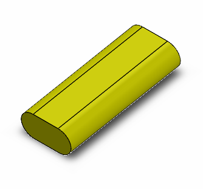
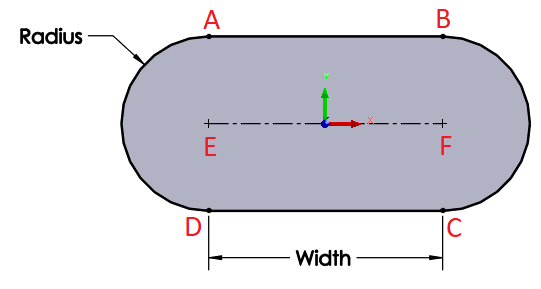

{ width=250 }

This VBA example demonstrates how to create a temp body by extruding the slot profile.

Macro will stop the execution and display the preview of the slot in the graphics area. Continue the macro to hide the preview and dispose temp body.

Slot profile is built in the *GetSlotProfileBody* function as per the parameters below:

{ width=250 }


