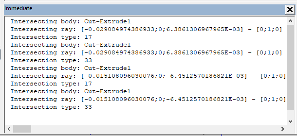
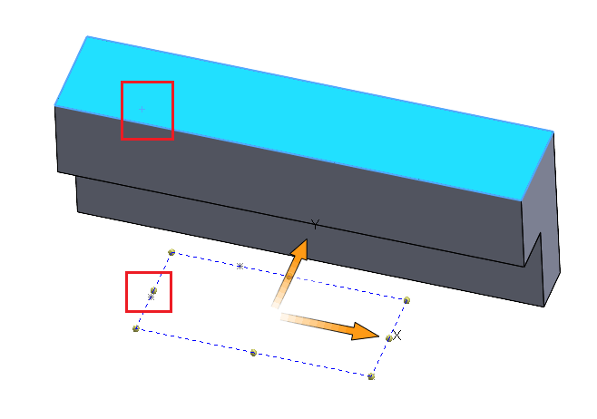

This VBA macro example demonstrates how to find the intersection points and the corresponding topology entities between all solid bodies of the active SOLIDWORKS part document and rays created from the sketch points of the selected sketch.

## How To Run The Macro

* Open or create a part document with visible solid bodies.
* Create 2D sketch with sketch points. Sketch points will be used as the starting points of the ray. And the sketch normal will be used as the direction for the rays
* Select the sketch above
* Run the macro. Macro will find all the intersections and pause on every found result
    * Macro will output the information about each ray into the [VBA Immediate Window](/visual-basic/vba/vba-editor/windows#immediate-window). Information includes the name of the body, ray information (starting point and direction), and intersection type as defined in [swRayPtsResults_e](https://help.solidworks.com/2020/english/api/swconst/SolidWorks.Interop.swconst~SolidWorks.Interop.swconst.swRayPtsResults_e.html)
    
    

    * Macro will select the corresponding entity (face or edge) which ray has hit. The selection point will indicate the point where the ray hit the entity
    * Continue macro with F5 or **Run** button in VBA editor to iterate all results

    

