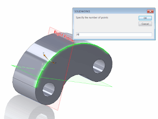
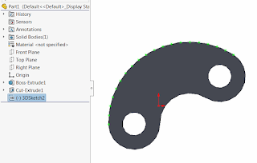

This macro creates specified number of sketch points on the selected edge in the 3D sketch using SOLIDWORKS API.

1. Open SOLIDWORKS part
1. *(Optionally)* Open 3D Sketch to insert points to the existing sketch, otherwise new sketch will be created
1. Run the macro. Enter the number of points to generate

{ width=320 height=239 }

As the result specified number of sketch points is generated in the 3D sketch:

{ width=320 height=204 }



Alternatively, it is possible to create points based on the curve length. The following example will create points by calculating the approximate length from curve tessellation points:



or by calculating the distance based on the total curve length:


