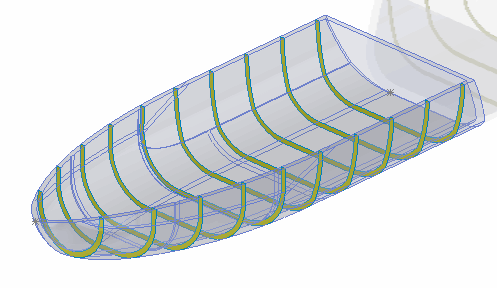

{ width=350 }

This example demonstrates how to slice the selected body and find the section properties of the resulting section slices using SOLIDWORKS API.

* Specify the number of required slices in the *SLICES_COUNT* constant
~~~ vb
Const SLICES_COUNT As Integer = 100
~~~
* Select solid body in Part document
* As the result:
    * Body is sliced in Y direction
    * Area of each slice is output to the immediate window in VBA editor
    * Previews of each slice is displayed in the graphics area
* Continue the macro to hide the preview

## Algorithm

### Identifying the starting point and the maximum length of the body

* Find 2 extreme points in positive and negative direction of the direction vector (Y vector in this example)
* Project those points onto the direction vector line (vector can be fixed at any point, in this example it is fixed at 0, 0, 0).
* Once projected calculate the distance between points - this will be equal to the maximum length of the body
* First extreme point is a starting point

### Identifying the maximum radius of the body
It is only required to find big enough radius to cover the body. This radius will be used to create a planar body for intersection purposes. In this example the maximum radius is equal to the diagonal of the bounding box which will ensure the planar section will cover the input body

### Calculate sections
* Calculate the step of section
* For each section move the starting point by the step. Sections at end points should be skipped as it won't produce any intersection results
* At each step create a temp section plane (disc) and intersect it with the solid body
    * Result of the intersection is the sheet body (or bodies) which is a section slice at this position
    * Store the pointer to the section in the collection
    * All the properties can be accessed from the resulting body (e.g. surface area)

### Preview the results
* Display each of the resulting bodies as a preview
* Stop the execution of the macro to validate the result
    * It might be required to hide or change the transparency of the original body to see the sections displayed
* Continue macro execution. This will clear the preview


