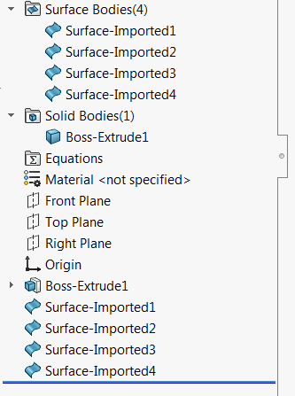

{ width=250 }

This macro creates individual surface (sheet) body for each face of the selected solid or surface body using the [IModeler::CreateSheetFromFaces](https://help.solidworks.com/2018/english/api/sldworksapi/solidworks.interop.sldworks~solidworks.interop.sldworks.imodeler~createsheetfromfaces.html) SOLIDWORKS API method.



For more advanced functionality (supporting parametric approach) refer the [Geomtery++ Split Body By Faces feature](/labs/solidworks/geometry-plus-plus/user-guide/split-body-by-faces/)
