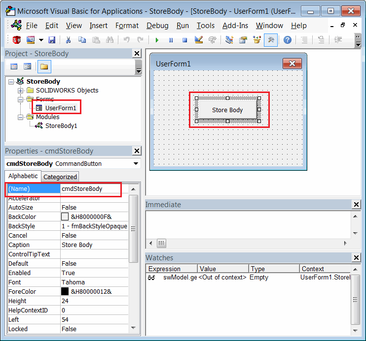
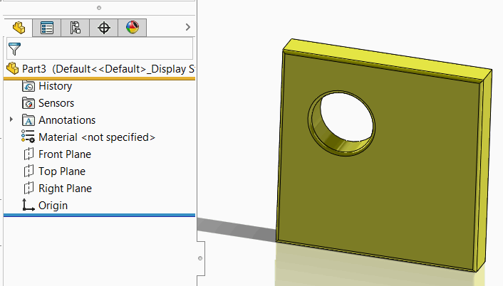

This VBA example demonstrates how to store the copy of the selected body in the new document's stream and restore and display the body on model opening.

Body is serialized and deserialized from the [3rd party storage](/solidworks-api/data-storage/third-party/).

* Create new macro and add new form. Name it *UserForm1* (default name)
* Add the button. Specify the caption *Store Body* and name *cmdStoreBody* as shown below

{ width=450 }

* Paste the following into the user form's code behind:



* Insert the following code into the macro's main module:



## Running Macro

* Start the macro from the main module. Note, if you run the macro when form is active in the macro editor - form will be displayed as modal window and will prevent selections and saving
* Open any part document with any geometry
* Select solid body from the tree and click *Store Body* in the user form
* New part document is created and the following message is displayed: *Save this document to store the body in its stream*
* Save this file. When file is saving the body from different part is serialized into the stream of new document and no longer related to the original body.
* Once completed, the following message is displayed: *Body is stored to the model stream. Close and reopen the model to restore the body*
* Now, close all documents and reopen the last saved file. The body is deserialized and displayed. Note, that there is no feature tree in the model.

{ width=350 }

* You can close SOLIDWORKS session and reopen the model. The body will still be loaded. Note, you need to run the macro before opening the model.